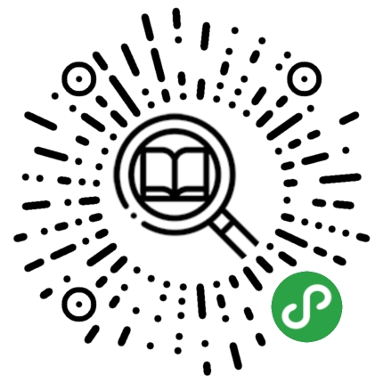

# Mountain-People-Language

> Chinese translation English support provided by [Google Translate](https://translate.google.cn/?hl=zh-CN&tab=TT)

## I. Overview

### 1 Core content

Mountain-People-Language：Cultural Protection of the Yi Nationality

### 2 Project way

- Format: Applet, Website, WeChat Public Account, Short Video
- Contents: Organize and collect Yi language, characters, costumes, architecture, literature, songs, food, festivals, customs, paintings, handicrafts, etc.

## II. plans

### 1 Yi WeChat Mini Program

#### Introduction

The survey found that the current Yi language applications or small programs basically only cover the pronunciation of a certain area. The project goal is to make a Yi language dictionary covering all Yi areas and all phonetic systems.

#### Work Process

1. Develop **WeChat Mini Program**, sample：“hust致知” WeChat Mini Program

   

   

2. Sort out the existing Simplified Chinese and Yi common characters, ancient characters and compare **text data**

3. Add dictionary entry to **database**

4. Collect Yi text and voice, organize each text into **folder** classification, the folder includes

   > - Word
   > - Voice
   > - Interpretation and sentence making

5. Import voice data into **database**

### 2 Yi culture website

#### Introduction

Sort out the cultural heritage of the Yi nationality, with a certain actual carrier, including but not limited to the following: architecture, clothing, literature, songs, food, festivals, customs, paintings, handicrafts, etc.

#### Work Process

1. Build **website**, record **domain name**, sample：[胡晗's Blog](http://mi_chuan.gitee.io/michuanblog/)，[CodePoetry](https://michuan.github.io/)
2. Sort out various cultural heritages and classify them in the form of pictures, texts, audio and video
3. Display the collected data on the website

### 3 Mountain-People-Language WeChat public account

#### Introduction

Synchronize the progress of the project, and the collated data can also be published to the platform, including the work content of the above two parts.

#### Work Process

1. Organize cultural heritage materials
2. Learn public account typesetting knowledge
3. Tweets are posted regularly, based on collated information

### 4 Video account

#### Introduction

Now the short video platform has more influence. The data collected during the data collection process is made into short video, which can provide funds for the project. The video content includes Yi language teaching, Yi language song recording video, and the process of collecting Yi cultural heritage. The records are organized into vlog form, and the follow-up technical and financial conditions are mature, and they will be aggregated into documentaries.

#### Work Process

1. Collect audio and video material
2. Record and edit video
3. Publish to short video platforms, promote, operate, obtain funds, and at the same time increase the exposure and influence of the project, and attract more talents who are interested in the protection of Yi nationality cultural heritage.

### 5 Copyright Protection

#### Introduction

Copyright needs to be deployed in advance, including but not limited to **registered trademarks**, patent applications, filing website **domain names**, filing with the Cultural Affairs Bureau, preparing legal litigation documents in advance, doing copyright protection consultation and follow-up legal support for copyright protection in advance

#### work process

1. Trademark
2. Record website domain name
3. Apply for software technology patents
4. The Cultural Affairs Bureau has filed this project (the protection of cultural heritage of the Yi nationality)
5. Legal advice and legal proceedings